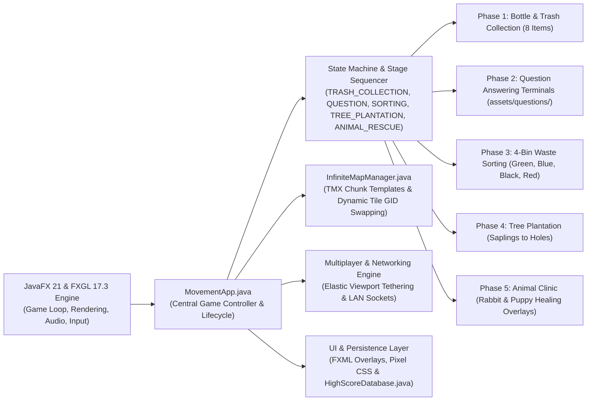

<p align="center">
  
</p>

<p align="center">
  
</p>
<p  align="center">        </p>  <p  align="center">          </p>

## ▶️ Video Link

👉 <a href = "https://www.youtube.com/watch?v=4dO_S5ldA9Q&feature=youtu.be"> Click here to see the video presentation

## 🌿 Project Overview

**Restoration** is an 8-bit retro 2D isometric cooperative eco-survival and educational game built with **Java 21**, **JavaFX**, and **FXGL**.

Players are thrust into a decaying, polluted wasteland. A continuous countdown timer represents the ecological clock. To survive, players must venture through the map and keep restoring the environment through accomplishing ecological tasks:

- Picking up scattered bottles and trash bags.
- Answering environmental science questions at interactive terminals.
- Sorting diverse waste items into designated recycling bins.
- Planting saplings into barren soil holes.
- Medically treating injured wildlife (rabbits and puppies) using veterinary tools.

As players complete tasks, the game world **physically transforms in real-time**: barren, cracked wasteland tiles seamlessly heal into vibrant green grass, waterways purify, and district boundaries dissolve, allowing exploration of an infinite world.

## 👥 Team Intro

<div align="center">

| Student Name | Student ID | Core Responsibilities |
| :--- | :---: | :--- |
| **Abu Sayem Rafi** | `230041106` | Garbage Collection, Garbage Sorting, Game HUD, Shared Screen Co-op |
| **Ahmed Samin Yasar** | `230041113` | Animal Rescue,  Quizzes, Map & World Building, Music & Sound Effects |
| **Mahfuz Kamal Sohan** | `230041130` | Tree Plantation, Menu & UI, Assets & Animation, LAN Implementation |

**Course:** CSE 4402 — Visual Programming Laboratory  
**Department:** Computer Science and Engineering (CSE)
**Institution:** Islamic University of Technology

</div>

---

## 🧩 Core Mechanics & Gameplay Stages (The "How")

The game structures each district through procedural tasks across five distinct stages:

### 🍾 Phase 1: Bottle & Trash Collection

- **Mechanics:** 8 litter items spawn across walkable tiles in the district, alternating between *plastic bottles* and *trash bags*.
- **Interaction:** Players navigate near each waste item and press <kbd>E</kbd> / <kbd>Space</kbd> (Player 1) or <kbd>/</kbd> (Player 2) to collect it.
- **Goal:** Collecting all 8 items cleans the local soil, awards Eco-Score, grants bonus survival time, and completes the phase.

### ❓ Phase 2: Question Answering Terminals

- **Mechanics:** 2 Interactive question terminals (`EntityType.QUESTION_POINT`) spawn within the district.
- **Interaction:** Approaching a terminal displays a pixel-styled multiple-choice question panel sourced from `assets/questions/environment.dat`.
- **Question Answering:** Players review questions on ecology, renewable energy, and conservation, selecting answers using number keys (<kbd>1</kbd>, <kbd>2</kbd>, <kbd>3</kbd>) or mouse clicks.
- **Outcome:** Choosing the best answer awards score bonuses and time extensions, advancing the district towards completion; choosing the 2nd best answer gives no points; choosing the wrong/worst option results in a time penalty.

### 🚮 Phase 3: Waste Sorting into Classified Bins

- **Mechanics:** 8 waste items are generated from a 32-item catalog, accompanied by four color-coded recycling receptacles:
  - 🟢 **Green Bin (Organic):** Banana peels, apple cores, tea bags, eggshells, coffee grounds, vegetable scraps, dry leaves, orange peels.
  - 🔵 **Blue Bin (Recyclable):** Newspapers, aluminium cans, water bottles, cardboard boxes, glass jars, food tins, office paper, detergent bottles.
  - ⚫ **Black Bin (General Waste / Landfill):** Snack wrappers, foam boxes, soiled tissues, plastic straws, crisp packets, coffee cups, broken ceramics, worn toothbrushes.
  - 🔴 **Red Bin (Hazardous & E-Waste):** Used batteries, broken phones, medicine blister packs, light bulbs, ink cartridges, phone chargers, aerosol cans, button-cell batteries.
- **Single Player Workflow:** The player picks up an item, views its name and category, walks to the matching bin, and deposits it.
- **Cooperative Workflow:** In co-op mode, a central **INTAKE** station is introduced: Player 1 gathers waste to the INTAKE point, while Player 2 inspects and sorts items from INTAKE into the respective bins.

### 🌱 Phase 4: Tree Plantation & Reforestation

- **Mechanics:** 6 young saplings (`plant.png`) and 6 planting holes (`hole.png`) spawn across the district.
- **Interaction:** Players approach a sapling to pick it up (rendering a carried plant indicator on the player sprite), carry it to an open hole, and press the interact key to plant it.
- **Outcome:** Once all 6 trees are planted, the soil regenerates, triggering a localized greening effect.

### 🐰 Phase 5: Wildlife Rescue & Medical Clinic

- **Mechanics:** An injured animal spawns in the district, alternating between an **injured forest rabbit** and a **thorn-struck puppy**.
- **Integrated Medical Overlay:** Interacting with the animal locks player movement and opens an in-scene pixel-art veterinary interface:
  - **Puppy Treatment:** Use **surgical pliers** to pluck thorn from its paw, followed by applying **sterile bandages**.
  - **Rabbit Treatment:** Apply **antiseptic ointment** to disinfect wounds, followed by **adhesive bandages**.
- **Outcome:** The healed animal leaps up and safely returns to nature, restoring harmony to the district.

---

## 🏗️ Technical Architecture

A simplified, vertical architectural overview of the system:



### Key Technical Subsystems

1. **Procedural Map & Tile Morphing (`InfiniteMapManager.java`):**
   - Parses modular isometric chunk templates designed in Tiled (`.tmx`).
   - Dynamically transforms tile GIDs in real-time as the global `restorationRatio` increases:
     - Degraded/polluted tiles (GIDs 35–38) dynamically transition through intermediate rehabilitation stages (GIDs 17, 18) to pristine grass (GID 20).
2. **Co-op Synchronization & Tethering:**
   - **Shared Screen:** Elastic distance formula clamps Player 1 and Player 2 within `MAX_TETHER_DISTANCE` (400px), keeping both players within the visible camera viewport.
   - **LAN Multiplayer:** Low-latency socket protocol synchronizes player coordinates, carrying states, and district progression across separate computers.
3. **UI & Styling:**
   - Custom FXML layouts (`game_end_overlay.fxml`, settings, high scores) styled via `pixel_style.css` with 8-bit typography (`Press Start 2P`).

---

## ⌨️ Controls Guide

### 🎮 Player 1 Controls

| Key | Action |
| :---: | :--- |
| <kbd>W</kbd> / <kbd>A</kbd> / <kbd>S</kbd> / <kbd>D</kbd> | Move Up / Left / Down / Right |
| <kbd>E</kbd> / <kbd>Space</kbd> | Interact (Collect bottle/trash, Answer question, Pick/Place plant, Sort waste, Heal animal) |
| <kbd>1</kbd> / <kbd>2</kbd> / <kbd>3</kbd> | Select Quiz Option (at Question Point) |

### 🕹️ Player 2 Controls (Shared-Screen Co-op)

| Key | Action |
| :---: | :--- |
| <kbd>↑</kbd> / <kbd>←</kbd> / <kbd>↓</kbd> / <kbd>→</kbd> | Move Up / Left / Down / Right |
| <kbd>/</kbd> / <kbd>NumPad 0</kbd> | Interact / Action |

### ⚙️ General & UI Controls

| Key | Action |
| :---: | :--- |
| <kbd>Esc</kbd> | Pause Menu / In-Scene Dialog Dismiss |
| <kbd>F11</kbd> | Toggle Fullscreen Mode |

---

## 🚀 Getting Started & Installation

### 📋 Prerequisites

- **JDK 21** or higher configured on your system `PATH`.
- **Gradle 8.10+** (or use the bundled `./gradlew` wrapper).

### 📥 Build & Execution

1. **Clone the repository:**

   ```bash
   git clone https://github.com/your-username/visual-programming-lab-project.git
   cd visual-programming-lab-project
   ```

2. **Compile the application:**

   ```bash
   ./gradlew compileJava
   ```

3. **Run automated test suites:**

   ```bash
   ./gradlew test
   ```

4. **Launch Restoration:**

   ```bash
   ./gradlew run
   ```

---

## 📊 Team Contribution Matrix

| Feature / Module | Abu Sayem Rafi (`230041106`) | Ahmed Samin Yasar (`230041113`) | Mahfuz Kamal Sohan (`230041130`) |
| :--- | :---: | :---: | :---: |
| **Garbage & Bottle Collection** | 🌟 Primary Lead | — | — |
| **Environmental Quizzes** | 🌟 Primary Lead | — | — |
| **Garbage Sorting (4 Bins)** | 🌟 Primary Lead | — | — |
| **Game HUD & Visual Notifications** | 🌟 Primary Lead | — | — |
| **Shared-Screen Co-op & Tethering** | 🌟 Primary Lead | — | — |
| **Animal Rescue & Medical Clinic** | — | 🌟 Primary Lead | — |
| **Map & World Building (TMX / Chunks)** | — | 🌟 Primary Lead | — |
| **Music & Sound Effects** | — | 🌟 Primary Lead | — |
| **Tree Plantation & Reforestation** | — | — | 🌟 Primary Lead |
| **Menu System & UI Overlays** | — | — | 🌟 Primary Lead |
| **Assets & Animation (Aseprite)** | — | — | 🌟 Primary Lead |
| **LAN Multiplayer Implementation** | — | — | 🌟 Primary Lead |

---

<p align="center">
  <i><font color="#2ECC71" face="Press Start 2P, monospace">Made for education, raising awareness, and cooperative gaming by the Restoration Team.</font></i><br>
</p>
